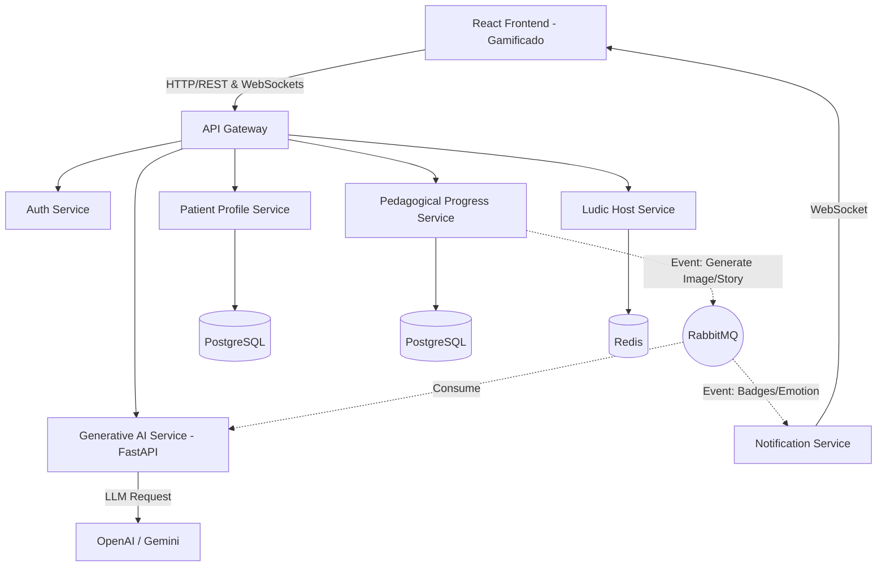

# IMIP Aprende 🦁✨

Uma plataforma web de alfabetização gamificada, concebida para crianças e adolescentes internados no IMIP, equipada com IA generativa e arquitetura moderna de microsserviços. 

O objetivo do projeto é transformar o processo de alfabetização em um ambiente hospitalar numa experiência lúdica, engajadora e altamente personalizada usando o poder da Inteligência Artificial.

---

## 🌟 Principais Funcionalidades

- **Gamificação e Nivelamento**: Sistema de XP, níveis e *streaks* que incentivam a criança a continuar aprendendo (estilo Duolingo).
- **Gerador de Trilhas com IA**: Criação de historinhas personalizadas em tempo real, geradas pela OpenAI e transmitidas instantaneamente para a tela via WebSockets.
- **Leo, o Mascote Interativo**: Um leãozinho construído em código (SVG + Framer Motion) que interage com o usuário dependo da tela em que ele se encontra.
- **Painel de Professores**: Controle ágil dos pacientes sob responsabilidade do educador/extensionista.
- **Segurança (Padrão LGPD)**: Anonimização de dados de crianças e rotas de backend protegidas via JWT.

---

## 🏗️ Arquitetura do Sistema

O projeto foi construído em uma arquitetura de **Microsserviços**, orquestrada pelo Docker Compose, para garantir que as rotas lentas de Inteligência Artificial não bloqueiem os acessos normais (como login e perfil de pacientes).



### Tecnologias Utilizadas
- **Frontend**: Vite, React, TypeScript, TailwindCSS, Framer Motion, Zustand.
- **Backend (Node.js)**: API Gateway, Auth Service, Profile Service, Progress Service, Ludic Host (Express.js, TypeScript).
- **Backend (Python)**: Generative AI Service (FastAPI, Celery).
- **Infraestrutura e Bancos de Dados**: Docker, PostgreSQL, Redis, RabbitMQ.

---

## 🚀 Como Rodar o Projeto Localmente

Para rodar o projeto do zero na sua máquina, você precisa ter o **Docker Desktop** (ou Docker Engine) e o **Node.js** instalados.

### 1. Subindo a Infraestrutura e o Backend (Via Docker)
Na raiz do repositório, execute o comando abaixo para construir as imagens e subir os contêineres:
```bash
docker-compose up -d --build
```
Isso vai iniciar o API Gateway (porta `8080`), todos os microsserviços Node, o microsserviço Python, além do Postgres, Redis e RabbitMQ. 

> **Aviso:** Sempre que você modificar o código de um microsserviço no backend, você precisa rodar `docker-compose up -d --build` novamente para que a imagem do Docker seja atualizada com o seu código novo!

### 2. Rodando o Frontend (Painel Interativo)
O Frontend é feito para rodar direto no seu host (na sua máquina) para que você tenha "Hot Reload" (atualização instantânea ao salvar o código).

Abra um terminal secundário e rode:
```bash
cd frontend
npm install
npm run dev
```
Acesse no seu navegador: **http://localhost:3000**

*(Use o e-mail `professor@imip.org.br` e qualquer senha para entrar no ambiente local)*

---

## 💻 Como Modificar o Código (Guia Rápido)

### Mexendo no Visual (Frontend)
- **Pasta:** `/frontend/src/`
- Toda a estrutura visual fica em `/frontend/src/pages/` e `/frontend/src/components/`. 
- **Estilo:** Utilizamos **TailwindCSS** direto nas classes do React (`className="bg-hospital-blue rounded-xl ..."`). Se quiser mudar as cores da marcação, edite o arquivo `/frontend/tailwind.config.js`.
- **Mascote:** O Leo está localizado em `/frontend/src/components/Mascot.tsx`. Suas animações são controladas pelo pacote `framer-motion`.

### Adicionando/Alterando Lógica de API (Zustand)
- **Pasta:** `/frontend/src/store/useStore.ts`
- É aqui que o Frontend se comunica com o Backend! O Zustand gerencia o estado global (token JWT, lista de pacientes, XP do nível atual) e faz as requisições HTTP (`fetch`) apontando para o API Gateway (Porta 8080).

### Mexendo no Backend e Banco de Dados
- **Pasta:** `/services/`
- Cada pasta dentro de `/services/` é um mini-servidor independente com seu próprio `package.json` e `Dockerfile`.
- Se você quiser, por exemplo, mudar a regra de experiência (XP), edite o arquivo dentro de `/services/ludic-host-service/src/index.ts`.
- **Roteamento:** O `/api-gateway/src/index.ts` é o maestro. Ele recebe todas as requisições na porta 8080 e repassa para o serviço correto usando o `http-proxy-middleware`. Se você criar um microsserviço novo, precisará criar a rota dele no Gateway.

### Modificando a Inteligência Artificial
- **Pasta:** `/services/generative-ai-service/`
- Diferente do resto do projeto, o microsserviço de IA é escrito em **Python (FastAPI)**. Ele se conecta à fila do RabbitMQ e aguarda o pedido para gerar as historinhas mágicas. Você precisará colocar sua chave da OpenAI no `.env` dessa pasta caso vá desenvolver ativamente modificações nos prompts do GPT-4.
